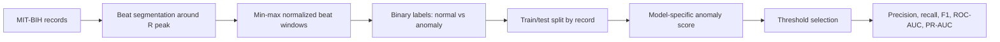

# ECG Anomaly Detection

Project for the course "Geometric Learning, Time-Variant Data Analysis, and Anomaly Detection".

The goal is to detect anomalous ECG beats from the MIT-BIH Arrhythmia Database using a progression of models from classical time-series methods to reconstruction-based neural models.

## Current Pipeline

1. Load MIT-BIH ECG records and annotations with `wfdb`.
2. Segment each beat around the annotated R-peak position.
3. Use a 180-sample window: 90 samples before and 90 after the annotation.
4. Normalize each beat with min-max scaling.
5. Convert MIT-BIH beat symbols into binary labels:
   - `0`: normal
   - `1`: anomaly
6. Split train/test by record to reduce patient-level leakage.
7. Train anomaly detectors mainly on normal training beats.
8. Evaluate reconstruction/prediction scores with precision, recall, F1, ROC-AUC, and PR-AUC.

## Model Progression

The models are not intended as a random list. Each step answers a limitation of the previous one:

- **ARMA**: classical time-series baseline, directly linked to the course theory.
- **PCA reconstruction error**: linear reconstruction baseline, interpretable as a simple linear autoencoder.
- **LSTM Autoencoder**: nonlinear sequential reconstruction model for ECG beat windows.
- **VAE**: probabilistic latent-space model for reconstruction-based anomaly detection.
- **Liquid Neural Network**: exploratory compact/adaptive model for possible future deployment.

## Preliminary Results

Current experiments use a small 5-record subset to validate the pipeline before scaling to more data.

| Model | Operating point | Precision | Recall | F1 | ROC-AUC | PR-AUC | Main observation |
|---|---:|---:|---:|---:|---:|---:|---|
| ARMA | 95th percentile | 0.914 | 0.213 | 0.346 | 0.955 | 0.941 | Conservative: reliable detections but many missed anomalies. |
| PCA | 95th percentile | 0.500 | 1.000 | 0.667 | 0.930 | 0.960 | Too sensitive: predicts all evaluated beats as anomalous. |
| PCA | 99.9th percentile | 0.704 | 0.920 | 0.798 | 0.930 | 0.960 | Better preliminary trade-off on the balanced subset. |

These are not final results. They are used to validate the experimental workflow and understand threshold behavior.

## Repository Structure

- `config.py`: configuration values such as sampling rate, window size, paths, and seeds.
- `utils.py`: data loading, beat segmentation, labeling, splitting, and evaluation metrics.
- `models.py`: model definitions.
- `notebooks/01_data_exploration.ipynb`: initial MIT-BIH exploration.
- `notebooks/02_arma_baseline.ipynb`: ARMA baseline experiment.
- `notebooks/03_pca_baseline.ipynb`: PCA reconstruction baseline experiment.
- `notebooks/04_lstm_autoencoder.ipynb`: PyTorch LSTM Autoencoder experiment.

## Requirements

See `requirements.txt`.
